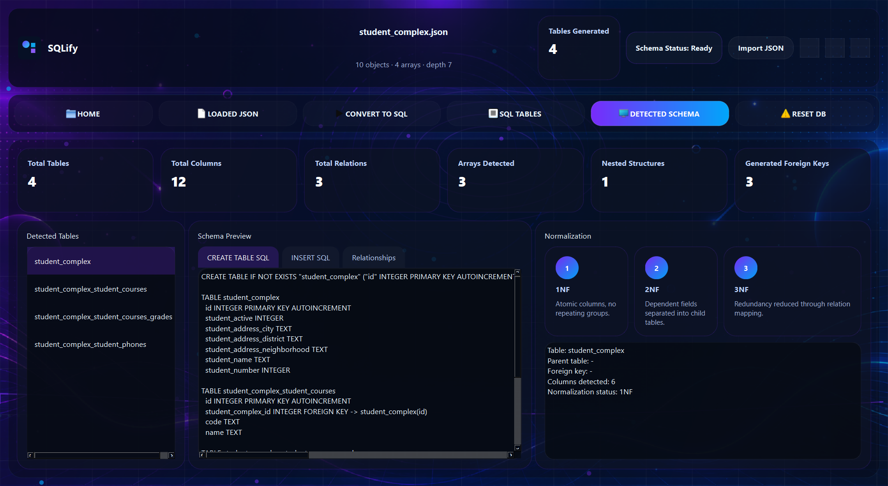
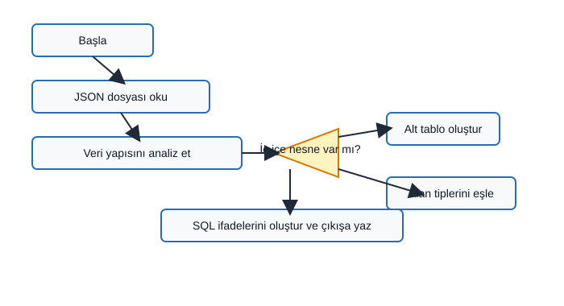
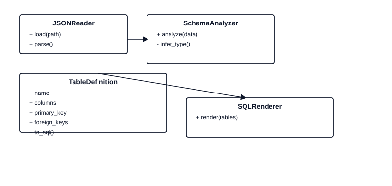
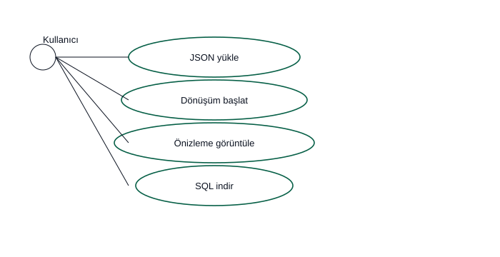

# SQLify ⚡

<p align="center">
  
</p>

<p align="center">
  <strong>Dynamic NoSQL JSON to Normalized Relational SQLite Converter & Visualizer GUI</strong>
</p>

<p align="center">
  
  
  
  
  
</p>

---

## 📌 Overview

**SQLify** is a desktop application designed to bridge the gap between semi-structured NoSQL JSON datasets and relational SQL databases. It dynamically parses deeply nested JSON objects, automatically normalizes embedded arrays into distinct child tables with primary-foreign key relationships, infers SQL types, and builds a fully queryable SQLite database on the fly.

Featuring a dark glassmorphic UI built with **PySide6 (Qt6)**, SQLify provides real-time schema visualization, live conversion telemetry, interactive table data browsing, and JSON hierarchy exploration.

---

## ✨ Key Features

- 🔄 **Dynamic Schema Inference**: Inspects arbitrary JSON structures and automatically generates normalized relational schemas (`CREATE TABLE` definitions with appropriate constraints).
- 🧩 **Smart Nested Object Flattening**: Automatically flattens composite objects (e.g., `address.city` → `address_city`).
- 🔗 **1:N Array Normalization**: Detects arrays of objects or primitives and creates separate child tables linked via foreign keys (`parent_id`) with `ON DELETE CASCADE`.
- ⚙️ **Configurable Type Mapping**: Map JSON logical data types (`string`, `int`, `float`, `bool`, `null`, `object`, `array`) directly to SQL data types via `config/type_mapping.json`.
- 📊 **Interactive Schema Visualizer**: Visual graph display illustrating table connections, columns, and foreign key relations.
- 🗄️ **Live Table Browser & Inspector**: Paginated, sortable data grid for browsing and filtering converted SQLite tables.
- 🌳 **JSON Hierarchy Explorer**: Interactive tree viewer with real-time key searching and metrics (object count, array count, nesting depth, size).
- ⚡ **Real-Time Telemetry & Progress**: Live conversion logs, table/relation counters, and stage-by-stage pipeline visualization.
- 🎨 **Modern Glassmorphic UI**: Responsive interface with animated status indicators, custom QSS styling, and drag-and-drop file loading.

---

## 📸 Screenshot


<p align="center">
  <strong>Interactive Schema & Relational Structure Inspector</strong><br>
  
</p>

---

## 🏛️ System Architecture

SQLify follows a modular architecture separating the conversion engine from the presentation layer:

### Conversion Pipeline Flowchart


### Class Diagram


### Use Case Diagram


---

## 📂 Project Structure

```
├── app.py                      # PySide6 GUI Application & Window Management
├── json_sql_converter.py       # Core Normalization & SQLite Engine
├── sqlify.bat                  # Windows Launcher Script (Auto-detects Python/Conda)
├── requirements.txt            # Python Dependencies
├── LICENSE                     # MIT Open-Source License
├── config/
│   └── type_mapping.json       # JSON-to-SQL Type Mapping Rules
├── assets/
│   ├── logo.svg                # Application Logo
│   ├── db_icon.svg             # Database Vector Icon
│   ├── waves.svg               # UI Vector Elements
│   ├── background.png          # App Wallpaper
│   ├── styles.qss              # Custom Qt Glassmorphism Stylesheet
│   ├── diagrams/               # UML & Architectural SVG Diagrams
│   └── screenshots/            # UI Showcase Screenshots
└── samples/                    # Sample JSON Datasets for Testing
    ├── company.json
    ├── student_complex.json
    ├── complex_dataset.json
    └── international_students_turkey.json
```

---

## 🚀 Quick Start

### Prerequisites

- **Python 3.10+** installed on your system.
- Git (optional, for cloning).

### 1. Clone the Repository

```bash
git clone https://github.com/sumitimran1/sqlify.git
cd sqlify
```

### 2. Create and Activate a Virtual Environment

**Windows (PowerShell):**
```powershell
python -m venv .venv
.\.venv\Scripts\Activate.ps1
```

**Linux / macOS:**
```bash
python3 -m venv .venv
source .venv/bin/activate
```

### 3. Install Dependencies

```bash
pip install -r requirements.txt
```

### 4. Run the Application

**Directly with Python:**
```bash
python app.py
```

**Or on Windows via Launcher:**
```cmd
sqlify.bat
```

---

## 🧪 Testing with Sample Data

SQLify includes several sample JSON files in the `samples/` directory:

1. Launch SQLify and click **"Open JSON File"** (or drag and drop any `.json` file into the window).
2. Select one of the provided datasets:
   - `samples/company.json` — Corporate hierarchy with nested departments and employees.
   - `samples/student_complex.json` — Academic records with courses, grades, and enrollments.
   - `samples/complex_dataset.json` — Large-scale dataset with deeply nested structures.
   - `samples/international_students_turkey.json` — Statistical data with multifaceted properties.
3. Switch to the **Convert** tab and click **"Start Conversion"**.
4. Inspect the generated relational tables and schema graph in the **Tables** and **Schema** tabs.

---

## ⚙️ Configuration

Custom SQL data type mappings can be specified in `config/type_mapping.json`:

```json
{
  "string": "TEXT",
  "int": "INTEGER",
  "float": "REAL",
  "bool": "INTEGER",
  "null": "TEXT",
  "object": "TEXT",
  "array": "TEXT"
}
```

---

## 🛠️ How Normalization Works

1. **Object Flattening**: Primitive key-value pairs at the root level form the parent table's columns. Nested sub-objects are recursively flattened with delimiter prefixes (`user_profile_bio`).
2. **Array Splitting**: When an array is encountered (e.g. `"skills": ["Python", "SQL"]` or `"orders": [{...}]`), SQLify:
   - Creates a dedicated child table (`root_skills` or `root_orders`).
   - Assigns an auto-incrementing `id` primary key.
   - Creates a `root_id` foreign key referencing the parent table's `id`.
   - Populates child records linked to their corresponding parent rows.

---

## 🤝 Contributing

Contributions, issues, and feature requests are welcome!

1. Fork the Project
2. Create your Feature Branch (`git checkout -b feature/AmazingFeature`)
3. Commit your Changes (`git commit -m "Add some AmazingFeature"`)
4. Push to the Branch (`git push origin feature/AmazingFeature`)
5. Open a Pull Request

---

## 📄 License

Distributed under the MIT License. See `LICENSE` for more information.
